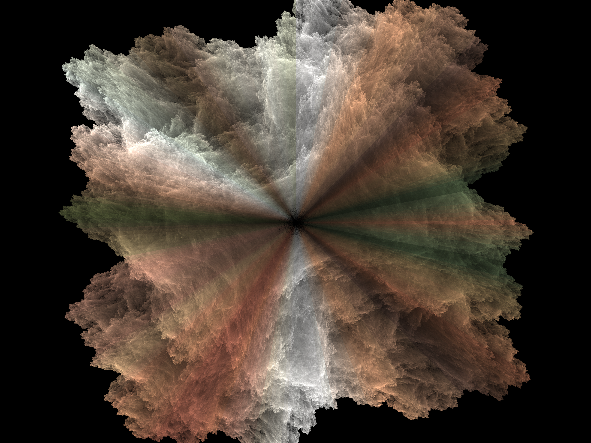

# Apophysis 7X — C++ Port

A modern C++20/Qt6 port of [Apophysis 7X](https://sourceforge.net/projects/apophysis7x/),
the classic fractal-flame editor. This is a ground-up reimplementation of the
original Delphi/VCL application — same rendering algorithm and variation
library, new codebase — built for better performance and long-term
maintainability, not a wrapper or a patch on top of the original.

> **Status:** actively developed. Core rendering, flame editing, and the
> majority of the original UI have been ported; see
> [`docs/MISSING_FEATURES_PLAN.txt`](docs/MISSING_FEATURES_PLAN.txt) and
> [`docs/FOLLOWUP_PLAN.txt`](docs/FOLLOWUP_PLAN.txt) for the detailed,
> ongoing audit of what's been ported and what's left. Builds and runs on
> Windows, Linux, and macOS, verified by CI on every push
> (`.github/workflows/ci.yml`); tagged releases are packaged for all three
> — see [Installation](#installation) — by
> [`.github/workflows/release.yml`](.github/workflows/release.yml).

See [`docs/USAGE.md`](docs/USAGE.md) for a guide to using the app itself —
the library window, the flame editor, rendering, gradients, and the
randomization tools.

## Installation

Prebuilt packages (no compiler, Qt, or vcpkg required) are published on
[GitHub Releases](https://github.com/andrewlkirby/apophysis-cpp/releases)
by [`.github/workflows/release.yml`](.github/workflows/release.yml). Install
with a one-line script, which downloads the right package for your OS,
verifies its checksum, and installs it:

**macOS / Linux:**
```
curl -fsSL https://raw.githubusercontent.com/andrewlkirby/apophysis-cpp/main/install.sh | bash
```

**Windows** (PowerShell):
```
irm https://raw.githubusercontent.com/andrewlkirby/apophysis-cpp/main/install.ps1 | iex
```

macOS installs to `/Applications` (or `~/Applications`); Linux installs an
AppImage plus a launcher to `~/.local/bin/apophysis7x` and a desktop-menu
entry; Windows installs to `%LOCALAPPDATA%\Apophysis7X` plus a Start Menu
shortcut. Both scripts are plain, readable shell/PowerShell — inspect
before piping into `bash`/`iex` if you'd rather not blind-pipe, or download
a release asset directly from the [Releases page](https://github.com/andrewlkirby/apophysis-cpp/releases)
and run/unzip it yourself.

This build isn't code-signed or notarized, so macOS Gatekeeper may refuse
the first launch ("cannot be opened because the developer cannot be
verified") — right-click the app in Finder and choose **Open**, or allow
it via System Settings > Privacy & Security.

## Features

- **Chaos-game renderer** — multithreaded, batch-based, with adaptive
  (density-estimation) filtering, gamma/vibrancy/brightness color
  correction, transparent-background export, and cooperative
  cancel/pause/resume mid-render.
- **~90 variations** ported from flam3/Apophysis, including the full local
  (parameterless) set and dozens of parametric variations, plus a
  compatibility shim for legacy third-party plugin variations (`julia`,
  `fisheye`, etc.).
- **Full flame editor** — triangle-based affine transform editing with live
  canvas drag, post-transforms, xaos, per-transform color/variation/variable
  tabs, symmetry tools, and undo/redo.
- **Gradient tools** — gradient browser/library, editing (rotate, hue,
  saturation, brightness, contrast, blur, frequency, invert, reverse), and
  smooth-palette generation.
- **Random flame / mutation tools** — configurable random batch generation
  (including variation blending and per-variation parameter randomization),
  a Mutate dialog for exploring nearby variants, and flame interpolation.
- **Render pipeline** — a render dialog for full-quality PNG export (with
  pause/resume), batch "Render All" for a whole library, and a headless CLI
  (`apo_render_cli`) for scripted rendering.
- **File compatibility** — reads/writes the original `.flame` (XML) and
  `.ugr`/gradient library formats.

## Screenshots

<table>
<tr>
<td width="33%">
<a href="imgs/Screenshot 2026-07-29 233558.png"></a><br>
<sub>The library window — a random batch of flames with thumbnails on the left and a live preview of the selected flame.</sub>
</td>
<td width="33%">
<a href="imgs/Screenshot 2026-07-29 233658.png"></a><br>
<sub>The flame editor — triangle-based affine transform editing, with the xform list, canvas, and per-transform property panel.</sub>
</td>
<td width="33%">
<a href="imgs/sample_img.png"></a><br>
<sub>A full-quality rendered flame, exported via the render pipeline.</sub>
</td>
</tr>
</table>

## Building from source

Only needed if you want to modify the code or build for a platform/arch the
release packages don't cover — for normal use, see
[Installation](#installation) above.

### Prerequisites

- **CMake** 3.20+
- **A C++20 compiler** — MSVC (Visual Studio 2022+), GCC, or Clang; all
  three are exercised in CI (Windows/MSVC, Linux/GCC via Ninja, macOS/Clang
  via Ninja).
- **[vcpkg](https://github.com/microsoft/vcpkg)**, for `pugixml` and
  `libpng` (pulled in automatically via `vcpkg.json` manifest mode — no
  manual `vcpkg install` needed, just point CMake at your vcpkg toolchain
  file).
- **Qt 6** (Widgets + Test components — both included in a base Qt6
  install), e.g. via a prebuilt SDK:
  ```
  pip install aqtinstall
  # Windows
  python -m aqt install-qt windows desktop 6.8.0 win64_msvc2022_64 -O C:\Qt
  # Linux
  python -m aqt install-qt linux desktop 6.8.0 linux_gcc_64 -O ~/Qt
  # macOS
  python -m aqt install-qt mac desktop 6.8.0 clang_64 -O ~/Qt
  ```
  Building Qt from source via vcpkg also works but takes considerably
  longer; a prebuilt SDK is the faster path.
  On Linux, running the app or its offscreen Qt tests also needs the usual
  Qt runtime libraries on the system (GL, xkbcommon, fontconfig, etc.) —
  see `.github/workflows/ci.yml` for the exact `apt-get install` list CI
  uses.

### Build

**Windows** (Visual Studio's generator is multi-config, so the build type is
chosen at build time, not configure time):
```
cmake -B build -DCMAKE_TOOLCHAIN_FILE=<vcpkg root>/scripts/buildsystems/vcpkg.cmake -DCMAKE_PREFIX_PATH=C:\Qt\6.8.0\msvc2022_64
cmake --build build --config Release
```
The GUI app builds as `build/src/ui/Release/apo_gui.exe`.

**Linux / macOS** (Ninja/Makefiles are single-config generators, so the
build type is chosen at configure time instead):
```
cmake -B build -G Ninja -DCMAKE_BUILD_TYPE=Release -DCMAKE_TOOLCHAIN_FILE=<vcpkg root>/scripts/buildsystems/vcpkg.cmake -DCMAKE_PREFIX_PATH=~/Qt/6.8.0/gcc_64
cmake --build build
```
The GUI app builds as `build/src/ui/apo_gui` on Linux, or
`build/src/ui/Apophysis 7X.app` (a proper .app bundle, needed for
`macdeployqt` packaging — see below) on macOS. Use `clang_64` in place of
`gcc_64` for the `CMAKE_PREFIX_PATH` on macOS.

Optional: enable AVX2 codegen for the render/variation hot path (raises the
minimum supported CPU to roughly Haswell/2013+) with
`-DAPO_CORE_ENABLE_AVX2=ON`.

### Run the tests

```
ctest --test-dir build -C Release   # Windows (multi-config generator)
ctest --test-dir build              # Linux/macOS (single-config generator)
```

Tests are split into pure-logic tests (no Qt widgets, `tests/*_test.cpp`)
and real-widget Qt interaction tests (`tests/ui/*_test.cpp`, simulated
mouse/keyboard events against actual compiled widgets, run with
`QT_QPA_PLATFORM=offscreen`).

### Headless rendering

```
apo_render_cli <input.flame> <output.png> [--seed=N] [--threads=N] [--width=W] [--height=H] [--index=N]
```

### Packaging a standalone build

**Windows and macOS** share a `package_zip` CMake target:

```
cmake --build build --config Release --target package_zip   # Windows (Release config at build time)
cmake --build build --target package_zip                     # macOS (Release chosen at configure time)
```

Produces `build/deploy/` (a self-contained, redistributable copy of the app
— Qt, and on Windows the MSVC runtime, DLLs included) and
`build/apophysis7x-<version>-win64.zip` or
`build/apophysis7x-<version>-macos-<arch>.zip` (the `.app`, on macOS). An
Inno Setup installer script is also provided for Windows at
`packaging/apophysis7x.iss` (`iscc packaging\apophysis7x.iss`, run from the
repo root, after the `deploy` step above).

**Linux** has no equivalent CMake target — its packaging tool
([linuxdeploy](https://github.com/linuxdeploy/linuxdeploy)) isn't part of
the Qt SDK and has to be fetched over the network, which a normal offline
`cmake --build` shouldn't require. Run it directly instead, after a Release
build:

```
packaging/linux-appimage.sh build <version> [output-dir]
```

Produces `apophysis7x-<version>-x86_64.AppImage`. Needs ImageMagick's
`convert` on `PATH` (to derive an icon from `src/ui/resources/app.ico`) —
`packaging/apophysis7x.png` can be dropped in to skip that requirement.

All three platforms' packages are what `install.sh`/`install.ps1` (repo
root) download — see [`.github/workflows/release.yml`](.github/workflows/release.yml)
for how they're built and published on a tagged release.

## Project layout

```
src/core/       Qt-free rendering engine, flame/variation data model, file I/O
src/core/variations/  Individual variation implementations
src/core/edit/  Pure mutation/randomization primitives (shared by UI and CLI)
src/core/render/       The chaos-game renderer
src/ui/         Qt6 Widgets application (MainWindow, EditorWindow, dialogs)
src/tools/      apo_render_cli, apo_bench
tests/          Logic tests (Qt-free) and tests/ui/ (Qt widget interaction tests)
docs/           Design/planning notes and audit logs from the porting effort
packaging/      Inno Setup installer script, Linux AppImage packaging
```

## License

GPL-3.0 — see [LICENSE](LICENSE), matching the original Apophysis 7X project.
